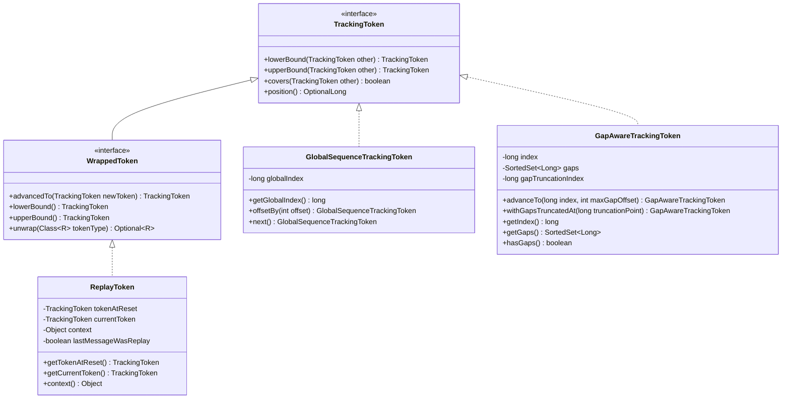
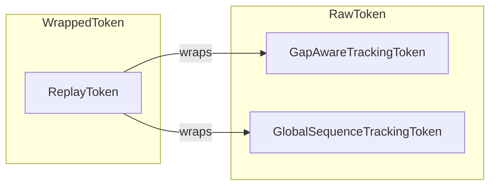
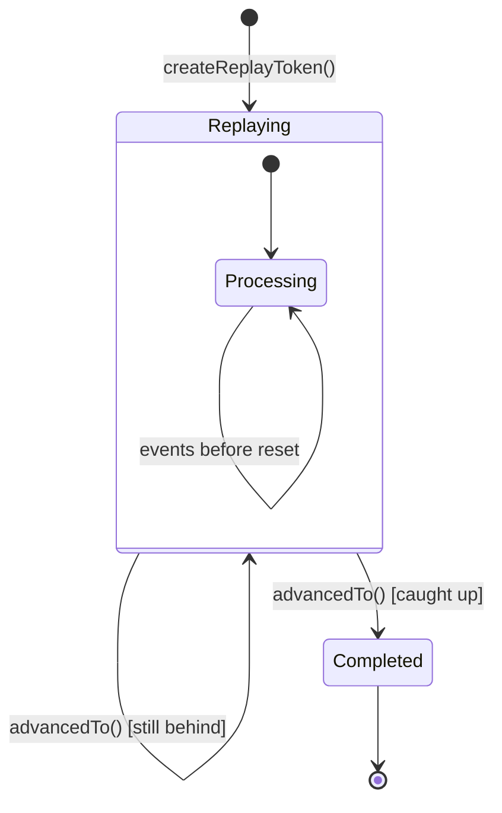
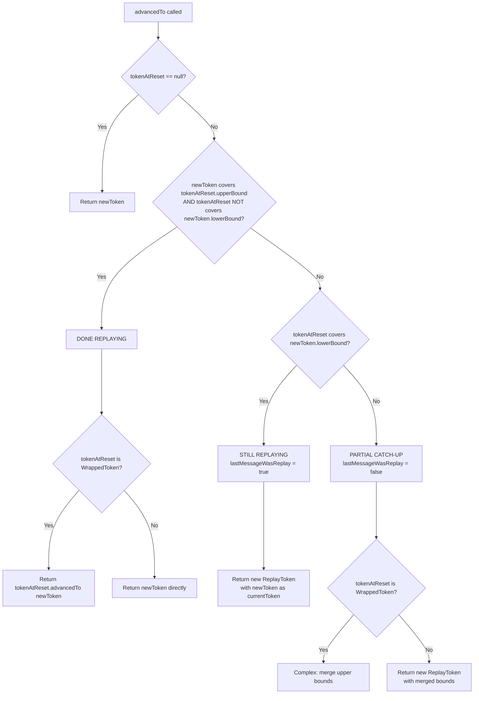

# TrackingToken Internals Documentation

This document provides comprehensive documentation of the TrackingToken system in Axon Framework 4, focusing on the internal mechanics of token comparison, boundary operations, and replay detection.

> **Critical Warning**: The `position()` method returns only an **ESTIMATE** and must **NOT** be used for decision-making in any comparison or boundary operations. It exists solely for progress reporting and UI purposes.

---

## Table of Contents

1. [Class Hierarchy](#class-hierarchy)
2. [TrackingToken Interface](#trackingtoken-interface)
3. [GlobalSequenceTrackingToken](#globalsequencetrackingtoken)
4. [GapAwareTrackingToken](#gapawaretrackingtoken)
5. [WrappedToken Interface](#wrappedtoken-interface)
6. [ReplayToken](#replaytoken)
7. [Comparison Methods Reference](#comparison-methods-reference)
8. [ReplayToken.advancedTo() Deep Dive](#replaytokenadvancedto-deep-dive)

---

## Class Hierarchy



---

## TrackingToken Interface

**Location**: `messaging/src/main/java/org/axonframework/eventhandling/TrackingToken.java`

The `TrackingToken` interface defines the contract for tracking position in an event stream. Event processors use tokens to maintain their position and determine which events have been processed.

### Core Methods

| Method | Purpose |
|--------|---------|
| `lowerBound(TrackingToken other)` | Computes the minimum position covering both tokens |
| `upperBound(TrackingToken other)` | Computes the maximum position reached by either token |
| `covers(TrackingToken other)` | Determines if this token has seen all events the other has seen |
| `position()` | Returns an **estimated** position (DO NOT use for comparisons) |

---

## GlobalSequenceTrackingToken

**Location**: `messaging/src/main/java/org/axonframework/eventhandling/GlobalSequenceTrackingToken.java`

The simplest token implementation using a single global sequence number. Useful for understanding the basic comparison semantics before studying more complex tokens.

### Internal State

```java
private final long globalIndex;  // The global sequence number of the event
```

### Method Implementations

#### `covers(TrackingToken other)`

```java
return otherToken == null || otherToken.globalIndex <= this.globalIndex;
```

**Behavior**: Returns `true` if this token's index is greater than or equal to the other's index.

| This Token | Other Token | Result | Explanation |
|------------|-------------|--------|-------------|
| Index 5 | Index 3 | `true` | This token has seen events 0-5, other only 0-3 |
| Index 3 | Index 5 | `false` | This token hasn't seen events 4-5 |
| Index 5 | Index 5 | `true` | Both have seen the same events |
| Index 5 | `null` | `true` | Any token covers null (no events) |

#### `lowerBound(TrackingToken other)`

```java
if (otherToken.globalIndex < this.globalIndex) {
    return otherToken;
} else {
    return this;
}
```

**Purpose**: Returns the token with the smaller index, representing the earliest position that would require reprocessing events not seen by both.

**Example**:
- Token A at index 10, Token B at index 5
- `A.lowerBound(B)` returns B (index 5)
- Messages 6-10 would be redelivered

#### `upperBound(TrackingToken other)`

```java
if (((GlobalSequenceTrackingToken) other).globalIndex > this.globalIndex) {
    return other;
}
return this;
```

**Purpose**: Returns the token with the higher index, representing the furthest position reached.

---

## GapAwareTrackingToken

**Location**: `messaging/src/main/java/org/axonframework/eventhandling/GapAwareTrackingToken.java`

A sophisticated token that tracks not just the highest seen sequence number, but also "gaps" - sequence numbers of events that may exist but haven't been processed yet.

### Why Gaps Exist

In high-concurrency scenarios, events may be assigned sequence numbers but not yet committed:
1. Transaction A gets sequence 100
2. Transaction B gets sequence 101
3. Transaction B commits first
4. Event processor sees event 101 but not 100 yet

The gap tracking allows the processor to continue without blocking, while remembering to check for the missing event later.

### Internal State

```java
private final long index;                    // Highest global sequence number seen
private final SortedSet<Long> gaps;          // Sequence numbers not yet seen (but < index)
private final transient long gapTruncationIndex;  // For gap cleanup optimization
```

### Visual Representation

```
Event Stream:  [0] [1] [ ] [3] [4] [ ] [6] [7] [8] [ ] [10]
                        ^           ^               ^
                       gap        gap             gap

Token State:
  index = 10
  gaps = {2, 5, 9}

Interpretation: Events 0, 1, 3, 4, 6, 7, 8, 10 have been seen
                Events 2, 5, 9 are missing (gaps)
```

### Method Implementations

#### `covers(TrackingToken other)`

```java
public boolean covers(TrackingToken other) {
    GapAwareTrackingToken otherToken = (GapAwareTrackingToken) other;

    // Handle gap truncation differences
    if (!this.gaps.isEmpty()
            && !this.gaps.headSet(otherToken.gapTruncationIndex).isEmpty()
            && this.gapTruncationIndex < otherToken.gapTruncationIndex) {
        return this.withGapsTruncatedAt(otherToken.gapTruncationIndex).covers(other);
    }

    return otherToken.index <= this.index
            && !this.gaps.contains(otherToken.index)
            && otherToken.gaps.containsAll(this.gaps.headSet(otherToken.index));
}
```

**Logic Breakdown**:
1. The other's index must be <= this index (we've reached at least as far)
2. The other's index must not be in our gaps (we must have actually seen that event)
3. All our gaps (up to the other's index) must also be gaps in the other (we haven't missed any event the other has seen)

**Examples from Tests**:

```java
// token1: index=3, gaps={1}  - seen: 0, 2, 3
// token2: index=4, gaps={2}  - seen: 0, 1, 3, 4
// token3: index=2, gaps={0,1} - seen: 2
// token4: index=3, gaps={}   - seen: 0, 1, 2, 3

assertFalse(token1.covers(token2));  // token1 hasn't seen index 4
assertFalse(token2.covers(token1));  // token2 has gap at 2, but token1 saw it
assertTrue(token1.covers(token3));   // token1 has seen everything token3 has
assertTrue(token4.covers(token1));   // token4 has no gaps, index >= token1.index
```

#### `lowerBound(TrackingToken other)`

```java
public GapAwareTrackingToken lowerBound(TrackingToken other) {
    GapAwareTrackingToken otherToken = (GapAwareTrackingToken) other;

    SortedSet<Long> mergedGaps = new TreeSet<>(this.gaps);
    mergedGaps.addAll(otherToken.gaps);
    long mergedIndex = calculateIndex(otherToken, mergedGaps);
    mergedGaps.removeIf(i -> i >= mergedIndex);
    return new GapAwareTrackingToken(mergedIndex, mergedGaps,
                                     Math.min(gapTruncationIndex, otherToken.gapTruncationIndex));
}

private long calculateIndex(GapAwareTrackingToken otherToken, SortedSet<Long> mergedGaps) {
    long mergedIndex = Math.min(this.index, otherToken.index);
    while (mergedGaps.contains(mergedIndex)) {
        mergedIndex--;
    }
    return mergedIndex;
}
```

**Purpose**: Compute the most conservative position that would ensure no events are missed by either token.

**Algorithm**:
1. Merge all gaps from both tokens
2. Start with the minimum of both indices
3. Walk backward while the index is in the merged gaps
4. Remove any gaps >= the final index

**Example**:
```java
// token1: index=3, gaps={1}   - seen: 0, 2, 3
// token6: index=1, gaps={}    - seen: 0, 1
// token1.lowerBound(token6) = index=0, gaps={}

// Why? Merged gaps = {1}
// Min index = 1, but 1 is a gap
// Walk back to 0
// Result: Start from position 0
```

#### `upperBound(TrackingToken other)`

```java
public TrackingToken upperBound(TrackingToken otherToken) {
    GapAwareTrackingToken other = (GapAwareTrackingToken) otherToken;

    // Gaps that exist in BOTH tokens (intersection)
    SortedSet<Long> newGaps = CollectionUtils.intersect(this.gaps, other.gaps, TreeSet::new);

    // Gaps after the lower index (from both)
    long min = Math.min(this.index, other.index) + 1;
    SortedSet<Long> mergedGaps = CollectionUtils.merge(
        this.gaps.tailSet(min),
        other.gaps.tailSet(min),
        TreeSet::new
    );
    newGaps.addAll(mergedGaps);

    return new GapAwareTrackingToken(
        Math.max(this.index, other.index),
        newGaps,
        Math.min(gapTruncationIndex, other.gapTruncationIndex)
    );
}
```

**Purpose**: Compute the furthest position that combines progress from both tokens.

**Algorithm**:
1. Keep gaps that are in **both** tokens (neither has seen those events)
2. For gaps after the lower index, merge them (these are still unprocessed by at least one)
3. Use the maximum index

**Example**:
```java
// token1: index=10, gaps={9}     - seen everything up to 10 except 9
// token3: index=15, gaps={14}    - seen everything up to 15 except 14
// token1.upperBound(token3) = index=15, gaps={14}

// Why?
// - Max index = 15
// - Gap {9} is resolved because token3 saw it (not in intersection)
// - Gap {14} remains (only token3 has reached that far)
```

#### `advanceTo(long index, int maxGapOffset)`

```java
public GapAwareTrackingToken advanceTo(long index, int maxGapOffset) {
    long newIndex;
    long smallestAllowedGap = Math.min(index, Math.max(gapTruncationIndex,
                                       Math.max(index, this.index) - maxGapOffset));
    SortedSet<Long> gaps = new TreeSet<>(this.gaps.tailSet(smallestAllowedGap));

    if (gaps.remove(index) || this.gaps.contains(index)) {
        // Filling a gap - index stays the same
        newIndex = this.index;
    } else if (index > this.index) {
        // Moving forward - create new gaps
        newIndex = index;
        LongStream.range(Math.max(this.index + 1L, smallestAllowedGap), index).forEach(gaps::add);
    } else {
        throw new IllegalArgumentException(...);
    }
    return new GapAwareTrackingToken(newIndex, gaps, smallestAllowedGap);
}
```

**Three Scenarios**:

1. **Filling a Gap**: `index` is in current gaps
   - Remove from gaps, keep same index

2. **Advancing Forward**: `index` > current index
   - Update index, add missing positions as new gaps

3. **Invalid**: `index` < current index and not a gap
   - Throws `IllegalArgumentException`

---

## WrappedToken Interface

**Location**: `messaging/src/main/java/org/axonframework/eventhandling/WrappedToken.java`

The `WrappedToken` interface provides a decorator pattern for tokens that wrap other tokens, adding additional semantics (like replay tracking).

### Core Concepts



### Key Methods

#### Static Unwrapping Methods

```java
// Get the innermost lower bound (current position)
static TrackingToken unwrapLowerBound(TrackingToken token) {
    return token instanceof WrappedToken ? ((WrappedToken) token).lowerBound() : token;
}

// Get the innermost upper bound (furthest position)
static TrackingToken unwrapUpperBound(TrackingToken token) {
    return token instanceof WrappedToken ? ((WrappedToken) token).upperBound() : token;
}

// Find a specific token type in the wrapper chain
static <R extends TrackingToken> Optional<R> unwrap(TrackingToken token, Class<R> tokenType)
```

#### Instance Methods

| Method | Purpose |
|--------|---------|
| `advancedTo(TrackingToken newToken)` | Create new token advanced to new position |
| `lowerBound()` | Get the current position token |
| `upperBound()` | Get the furthest reached position token |
| `unwrap(Class<R> tokenType)` | Find wrapped token of specific type |

---

## ReplayToken

**Location**: `messaging/src/main/java/org/axonframework/eventhandling/ReplayToken.java`

The `ReplayToken` tracks the position before a reset was triggered, allowing downstream components to detect replayed messages.

### Internal State

```java
private final TrackingToken tokenAtReset;      // Position when reset was triggered
private final TrackingToken currentToken;       // Current processing position
private final Object context;                   // Optional reset context
private final transient boolean lastMessageWasReplay;  // Replay status
```

### Lifecycle



### Creation: `createReplayToken()`

```java
public static TrackingToken createReplayToken(
        TrackingToken tokenAtReset,
        TrackingToken startPosition,
        Object resetContext) {

    // Case 1: No token at reset - just use start position
    if (tokenAtReset == null) {
        return startPosition;
    }

    // Case 2: tokenAtReset is already a ReplayToken - unwrap and recurse
    if (tokenAtReset instanceof ReplayToken) {
        return createReplayToken(((ReplayToken) tokenAtReset).tokenAtReset, startPosition, resetContext);
    }

    // Case 3: Start position already covers reset - no replay needed
    if (startPosition != null && startPosition.covers(WrappedToken.unwrapLowerBound(tokenAtReset))) {
        return startPosition;
    }

    // Case 4: Create a new ReplayToken
    return new ReplayToken(tokenAtReset, startPosition, resetContext);
}
```

### Method Implementations

#### `covers(TrackingToken other)`

```java
public boolean covers(TrackingToken other) {
    if (other instanceof ReplayToken) {
        return currentToken != null && currentToken.covers(((ReplayToken) other).currentToken);
    }
    return currentToken != null && currentToken.covers(other);
}
```

**Behavior**: Delegates to the `currentToken`, unwrapping other ReplayTokens first.

#### `lowerBound(TrackingToken other)`

```java
public TrackingToken lowerBound(TrackingToken other) {
    if (other instanceof ReplayToken) {
        return new ReplayToken(this, ((ReplayToken) other).currentToken, context);
    }
    return new ReplayToken(this, other, context);
}
```

#### `upperBound(TrackingToken other)`

```java
public TrackingToken upperBound(TrackingToken other) {
    return advancedTo(other);
}
```

The upper bound is computed by advancing to the other token.

---

## Comparison Methods Reference

### Summary Table

| Method | Purpose | Result |
|--------|---------|--------|
| `covers(other)` | Has this token seen all events the other has seen? | `boolean` |
| `lowerBound(other)` | What's the minimum position covering both? | Token at lower position |
| `upperBound(other)` | What's the maximum position reached? | Token at higher position |

### Behavior by Token Type

#### covers()

| Token Type | Returns `true` when |
|------------|---------------------|
| `GlobalSequenceTrackingToken` | `this.index >= other.index` |
| `GapAwareTrackingToken` | `other.index <= this.index` AND `other.index` not in our gaps AND our gaps are subset of other's gaps |
| `ReplayToken` | `currentToken.covers(other.currentToken)` |

#### lowerBound()

| Token Type | Returns |
|------------|---------|
| `GlobalSequenceTrackingToken` | Token with smaller index |
| `GapAwareTrackingToken` | Token with merged gaps and adjusted index |
| `ReplayToken` | New ReplayToken wrapping this with other's current |

#### upperBound()

| Token Type | Returns |
|------------|---------|
| `GlobalSequenceTrackingToken` | Token with larger index |
| `GapAwareTrackingToken` | Token with max index and intersection of gaps |
| `ReplayToken` | Result of `advancedTo(other)` |

---

## ReplayToken.advancedTo() Deep Dive

This is the **PRIMARY** method for understanding replay logic. It determines whether processing should continue in replay mode or transition to normal mode.

### Source Code

```java
public TrackingToken advancedTo(TrackingToken newToken) {
    if (this.tokenAtReset == null
            || (newToken.covers(WrappedToken.unwrapUpperBound(this.tokenAtReset))
                && !tokenAtReset.covers(WrappedToken.unwrapLowerBound(newToken)))) {
        // Case 1: Done replaying
        if (tokenAtReset instanceof WrappedToken) {
            return ((WrappedToken) tokenAtReset).advancedTo(newToken);
        }
        return newToken;

    } else if (tokenAtReset.covers(WrappedToken.unwrapLowerBound(newToken))) {
        // Case 2: Still replaying (well behind)
        return new ReplayToken(tokenAtReset, newToken, context, true);

    } else {
        // Case 3: Partially caught up (edge case with gaps)
        if (tokenAtReset instanceof WrappedToken) {
            return new ReplayToken(tokenAtReset.upperBound(newToken),
                    ((WrappedToken) tokenAtReset).advancedTo(newToken),
                    context,
                    false);
        }
        return new ReplayToken(tokenAtReset.upperBound(newToken), newToken, context, false);
    }
}
```

### Decision Tree



### The Three Cases

#### Case 1: Done Replaying

**Condition**:
```java
tokenAtReset == null                                              // Part 1
|| (newToken.covers(WrappedToken.unwrapUpperBound(tokenAtReset))  // Part 2A (Condition A)
    && !tokenAtReset.covers(WrappedToken.unwrapLowerBound(newToken))) // Part 2B (Condition B)
```

**Breaking Down Each Part:**

| Part | Code | Question Asked | Purpose |
|------|------|----------------|---------|
| **Part 1** | `tokenAtReset == null` | Is there even a reset point? | Guard clause - if no reset, just return newToken |
| **Part 2A** | `newToken.covers(tokenAtReset)` | Have we reached or passed the reset point? | Necessary but **not sufficient** |
| **Part 2B** | `!tokenAtReset.covers(newToken)` | Is this event actually NEW (not seen before)? | The discriminator - prevents premature exit |

---

**Why isn't Condition A (`newToken.covers(tokenAtReset)`) alone enough?**

The problem is that `covers()` uses `>=` comparison, not `>`. When both tokens are at the **same position**, they cover each other mutually:

```java
// Example: Both at position 7
tokenAtReset = GlobalSequenceTrackingToken(7)
newToken = GlobalSequenceTrackingToken(7)

// Condition A alone:
newToken.covers(tokenAtReset)  // 7 >= 7 = TRUE ✓

// If we only checked Condition A, we would EXIT replay!
// But event 7 WAS seen before reset - it IS a replay event!
```

Condition B prevents this premature exit:

```java
// With both conditions:
newToken.covers(tokenAtReset)      // 7 >= 7 = TRUE ✓
!tokenAtReset.covers(newToken)     // !(7 >= 7) = !TRUE = FALSE ✗

// Combined: TRUE && FALSE = FALSE
// We stay in replay mode - CORRECT!
```

---

**The Correct Exit Scenario:**

```java
tokenAtReset = GlobalSequenceTrackingToken(7)
newToken = GlobalSequenceTrackingToken(8)  // First NEW event

// Condition A: "Have we reached/passed the reset point?"
newToken.covers(tokenAtReset)  // 8 >= 7 = TRUE ✓

// Condition B: "Is this event actually NEW?"
!tokenAtReset.covers(newToken)  // !(7 >= 8) = !FALSE = TRUE ✓

// Combined: TRUE && TRUE = TRUE
// We EXIT replay mode - CORRECT!
```

---

**Visual Timeline:**

```
Event Stream:    [0] [1] [2] [3] [4] [5] [6] [7] [8] [9] [10]
                  ←─── SEEN BEFORE RESET ───→│←── NEW ──→
                                             │
                                tokenAtReset=7

Processing each event during replay:

Event  | covers(7)? | !covers(event)? | Combined | Result
-------|------------|-----------------|----------|------------------
  5    |   NO (5<7) |      -          |    -     | → Case 2 (replay)
  6    |   NO (6<7) |      -          |    -     | → Case 2 (replay)
  7    |  YES (7≥7) |   NO !(7≥7)     |  FALSE   | → Case 2 (replay) ← KEY!
  8    |  YES (8≥7) |  YES !(7≥8)     |   TRUE   | → EXIT replay ✓
```

**The key insight**: Event 7 was the last event seen before reset. Even though `newToken(7).covers(tokenAtReset(7))` is true, the second condition `!tokenAtReset.covers(newToken)` catches this and keeps us in replay mode, because event 7 **was already processed before**.

---

**Plain English Summary:**

- **Condition A** asks: *"Am I at or past the finish line?"*
- **Condition B** asks: *"Am I **past** the finish line (not standing on it)?"*

Both must be true to exit replay. Standing exactly ON the finish line (event 7 when tokenAtReset=7) means you're still replaying that event.

#### Case 2: Still Replaying

**Condition**:
```java
tokenAtReset.covers(newToken.lowerBound())
```

**Explanation**: The event at newToken was already seen before reset. This is a replay.

**Example with GlobalSequenceTrackingToken**:
```
tokenAtReset = 7
newToken = 5

Check: tokenAtReset(7).covers(newToken(5)) = true (7 >= 5)

Result: Still replaying, return ReplayToken(tokenAtReset=7, currentToken=5, replay=true)
```

#### Case 3: Partial Catch-up (Edge Case)

**Condition**: Neither Case 1 nor Case 2

**Explanation**: We're receiving an event that wasn't seen before reset, but we haven't fully caught up yet. This happens with gaps.

**Example with GapAwareTrackingToken**:
```
tokenAtReset = index=10, gaps={7}  // Event 7 wasn't seen before reset
currentToken = index=5, gaps={}
newToken = index=7, gaps={}        // This is the missing event!

Check: newToken.covers(tokenAtReset.upperBound)
       = (7).covers(10) = false
       tokenAtReset.covers(newToken.lowerBound)
       = (10,{7}).covers(7) = false (7 is in gaps!)

Result: Partial catch-up, lastMessageWasReplay = false
        New tokenAtReset = tokenAtReset.upperBound(newToken)
```

### Behavior with Different Token Types

#### With GlobalSequenceTrackingToken (Simple)

```java
// Setup: Reset at position 7, starting from 0
tokenAtReset = GlobalSequenceTrackingToken(7)
ReplayToken token = createReplayToken(tokenAtReset, null)  // starts at 0

// Process events 0-5: all replays
for (i = 0..5) {
    token = token.advancedTo(GlobalSequenceTrackingToken(i))
    assert token instanceof ReplayToken
    assert ReplayToken.isReplay(token) == true
}

// Process event 6: still replay (6 <= 7)
token = token.advancedTo(GlobalSequenceTrackingToken(6))
assert ReplayToken.isReplay(token) == true

// Process event 7: still replay (7 <= 7, equal means already seen)
token = token.advancedTo(GlobalSequenceTrackingToken(7))
assert ReplayToken.isReplay(token) == true

// Process event 8: DONE replaying
token = token.advancedTo(GlobalSequenceTrackingToken(8))
assert token instanceof GlobalSequenceTrackingToken  // Unwrapped!
assert ReplayToken.isReplay(token) == false
```

#### With GapAwareTrackingToken (Complex)

```java
// Setup: Reset at position 10 with gap at 9
tokenAtReset = GapAwareTrackingToken(index=10, gaps={9})
// This means events 0-8 and 10 were seen, but 9 was not

ReplayToken token = createReplayToken(tokenAtReset, null)

// Process events 0-8: all replays (they were seen before reset)
for (i = 0..8) {
    token = token.advancedTo(GapAwareTrackingToken(i, {}))
    assert ReplayToken.isReplay(token) == true
}

// Process event 9: NOT a replay! (it's in the gaps)
token = token.advancedTo(GapAwareTrackingToken(9, {}))
// This is the tricky Case 3!
// tokenAtReset.covers(newToken) = false because 9 is in gaps
// newToken.covers(tokenAtReset.upperBound) = false because index 9 < 10
assert ReplayToken.isReplay(token) == false  // NEW event!

// Process event 10: replay (it was seen before)
token = token.advancedTo(GapAwareTrackingToken(10, {}))
assert ReplayToken.isReplay(token) == true

// Process event 11: DONE replaying
token = token.advancedTo(GapAwareTrackingToken(11, {}))
assert token instanceof GapAwareTrackingToken
```

### Key Insight: covers() is the Decision Maker

The `advancedTo()` logic fundamentally relies on the `covers()` method:

1. **`tokenAtReset.covers(newToken)`** → Was newToken seen before reset?
   - `true` → It's a replay
   - `false` → It's new OR we've moved past reset

2. **`newToken.covers(tokenAtReset)`** → Has newToken advanced past reset?
   - `true` → We've caught up
   - `false` → Still behind or in a gap

The combination of these two checks creates the three cases.

---

## Appendix: Common Patterns and Edge Cases

### Pattern: Replay After Partial Processing

```
Before Reset:
  Events processed: [0, 1, 2, _, 4, 5, _, _, 8]
  Token: GapAwareTrackingToken(index=8, gaps={3, 6, 7})

After Reset (replay from start):
  tokenAtReset: GapAwareTrackingToken(index=8, gaps={3, 6, 7})
  currentToken: null (or GapAwareTrackingToken(-1, {}))

Processing:
  Event 0: replay (tokenAtReset covers 0)
  Event 1: replay
  Event 2: replay
  Event 3: NEW! (was a gap, tokenAtReset doesn't cover it)
  Event 4: replay
  Event 5: replay
  Event 6: NEW!
  Event 7: NEW!
  Event 8: replay
  Event 9: DONE replaying (advances past tokenAtReset)
```

### Edge Case: Double Replay

If a replay is triggered while already replaying, `createReplayToken` handles this:

```java
// First reset at position 10
token = ReplayToken.createReplayToken(GlobalSequenceTrackingToken(10))

// Second reset while at position 5
token = ReplayToken.createReplayToken(token, null)

// The inner ReplayToken is unwrapped:
// tokenAtReset extracts the original GlobalSequenceTrackingToken(10)
// Not a nested ReplayToken
```

### Edge Case: Reset Beyond Current Position

```java
TrackingToken tokenAtReset = new GlobalSequenceTrackingToken(1);
TrackingToken startPosition = new GlobalSequenceTrackingToken(2);

TrackingToken result = ReplayToken.createReplayToken(tokenAtReset, startPosition);

// startPosition.covers(tokenAtReset) = true
// Returns startPosition directly, no ReplayToken created
assertEquals(startPosition, result);
```

---

## Summary

The TrackingToken system provides a robust mechanism for:

1. **Position Tracking**: Via `index` and `gaps` in `GapAwareTrackingToken`
2. **Comparison Operations**: Via `covers()`, `lowerBound()`, `upperBound()`
3. **Replay Detection**: Via `ReplayToken.advancedTo()` and its use of `covers()`

The key to understanding `ReplayToken.advancedTo()` is understanding that:
- **`covers()` determines whether an event position was "seen" before reset**
- **The combination of bidirectional `covers()` checks classifies each event as replay, new, or done**
- **Gaps in `GapAwareTrackingToken` represent unseen positions that count as "new" events**