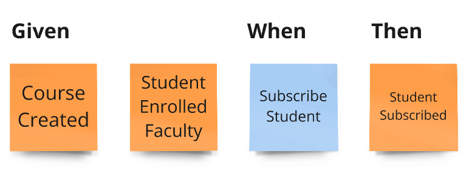

# Axon Framework 5 - Getting Started Sample Application
Axon version: 5.0.0-M1

## Event Store implementation

Now only the in-memory implementation of the Event Store is supported, but this still allows you try out the new Command handling API. 
The in-memory Event Store supports the [DCB (Dynamic Consistency Boundary) concept](https://www.youtube.com/watch?v=IgigmuHHchI).

# Domain: The Axon University

## Bounded Context: Faculty

In the faculty context there are students and courses, that students can subscribe to.

A student can enroll in the faculty. The administrators of the faculty can create a course with assigned capacity—the number of
students who can subscribe to a course. The capacity of the course must be maintained. After the course has been
created, its capacity can be changed. A student can subscribe to a course and unsubscribe.


After an Event Modeling (which you can see above) session, we have identified the following events:
* `StudentEnrolledInFaculty` - A fact that a student has enrolled faculty.
* `CourseCreated` - A fact that a course has been created with assigned capacity.
* `CourseCapacityChanged` - A fact that the capacity of the course has changed.
* `StudentSubscribedToCourse` - A fact that the student has subscribed to the course.
* `StudentUnsubscribedFromCourse` - A fact that the student has unsubscribed from the course.


## 🏛️ Screaming Architecture (Vertical Slices)

The project follows a [Screaming Architecture](https://www.milanjovanovic.tech/blog/screaming-architecture) pattern organized around vertical slices that mirror Event Modeling concepts.

The package structure screams the capabilities of the system by making explicit: commands available to users, events that capture what happened, queries for retrieving information, business rules, and system automations.
This architecture makes it immediately obvious what the system can do, what rules govern those actions, and how different parts of the system interact through events.

Each module is structured into three distinct types of slices (packages `write`, `read`, `automation`) and there are events (package `events`) between them, which are a system backbone - a contract between all other parts:
Thanks to Axon Framework 5 support dynamic boundaries, each slice can have its own entities based on the same events, and thus be totally independent. There's no need for cross-slice communication and can be developed in parallel. In Axon Framework 4 and other Event-Sourcing frameworks, they needed to share an aggregate.
Any slice can be implemented differently. Thanks to the architecture of Axon Framework, what really matters are messages (Commands, Events and Queries) that shape the API.

### Write Slices
Contains commands that represent user intentions, defines business rules through aggregates, produces domain events, and enforces invariants (e.g., SubscribeStudent command → StudentSubscribed event, with SubscriptionsPerStudentNotExceedMax rule).

### Read Slices [FOR THE FUTURE MILESTONES]
Implements queries and read models optimized for specific use cases, with projectors that transform events into queryable state (e.g., GetSubscriptionsByStudentId query → StudentSubscriptionsReadModel).

### Automation Slices [FOR THE FUTURE MILESTONES]
Processes events to trigger subsequent actions, implementing system policies and workflows that connect different modules (e.g., WhenStudentSubscribedThenSendEmailNotification).

## 🧪 Testing
Tests using the production app configuration, follows the approach:
- write slice: given(events) -> when(command) -> then(events)
- read slice: given(events) -> then(read model)
- automation: when(event, state?) -> then(command)

Tests are focused on observable behavior, so the domain model can be refactored without changes in tests.

### Example: write slice



```java
@BeforeEach
void beforeEach() {
    var application = new UniversityAxonApplication();
    fixture = AxonTestFixture.with(application.configurer());
}

@Test
void successfulSubscription() {
    var courseId = CourseId.random();
    var studentId = StudentId.random();

    fixture.given()
           .event(new CourseCreated(courseId.raw(), "Axon Framework 5: Getting Started", 2))
           .event(new StudentEnrolledFaculty(studentId.raw(), "Mateusz", "Nowak"))
           .when()
           .command(new SubscribeStudent(studentId, courseId))
           .then()
           .events(new StudentSubscribed(studentId.raw(), courseId.raw()));
}
```