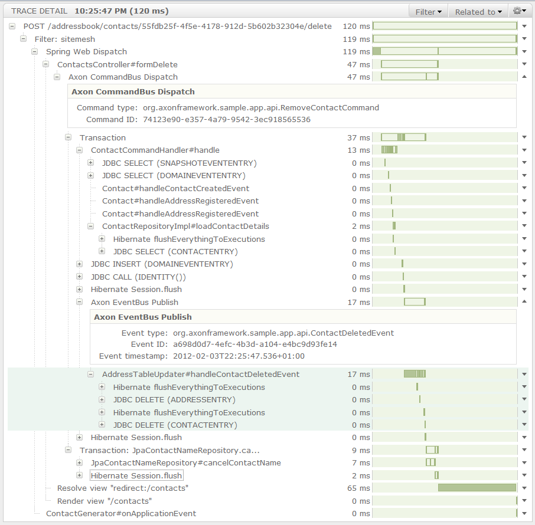

Axon plugin for Spring Insight
==============================

This project provides a plugin for the Axon framework that can be used with 
[Spring Insight](http://www.springsource.org/insight). It supports Axon 1.x
versions as well as the 2.0 version that's under development at the time of
writing.

It creates `Operation` instances for `CommandBus#dispatch`,
`EventBus#publish`, `Saga#handle` and event and command handler methods (both
annotated methods and interface-based implementations are matched). In
addition to that, there are `EndPointAnalyzer` implementations for the handler
methods: a simple one for sagas, and two for command and event handlers that
check that the handle invocations take place in the context of their
corresponding bus. Command and event types are captured, as well as additional
metadata where available.

Here's an example of a trace containing Axon frames: 

Usage
-----

Simply build the project using `mvn package` and then copy the resulting jar
file from the `target` directory into the `insight/collection-plugins`
directory of your Spring Insight-enabled tc Server instance. 

On (re)starting the server, the plugin will be enabled automatically.
